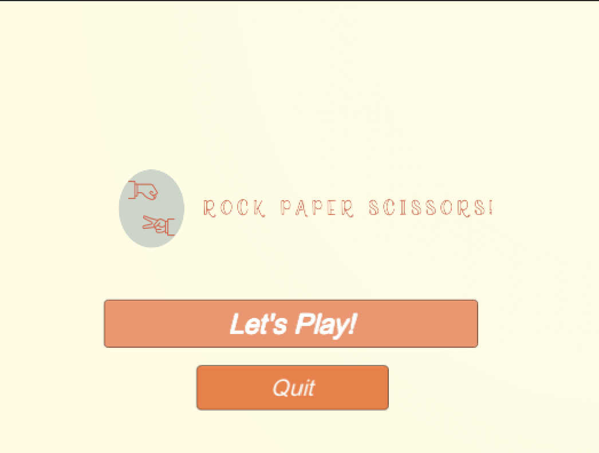
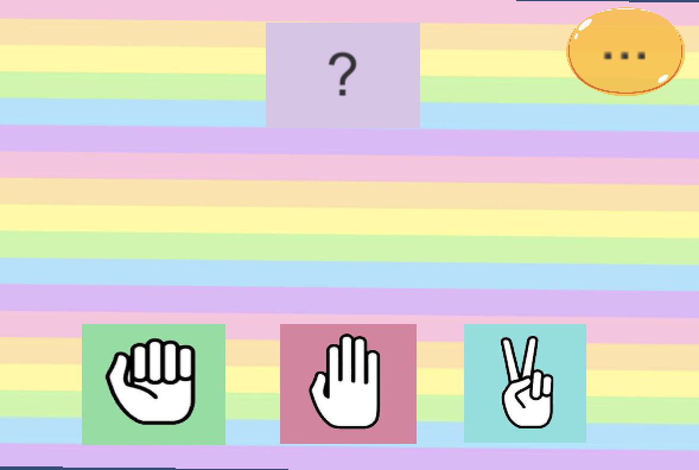
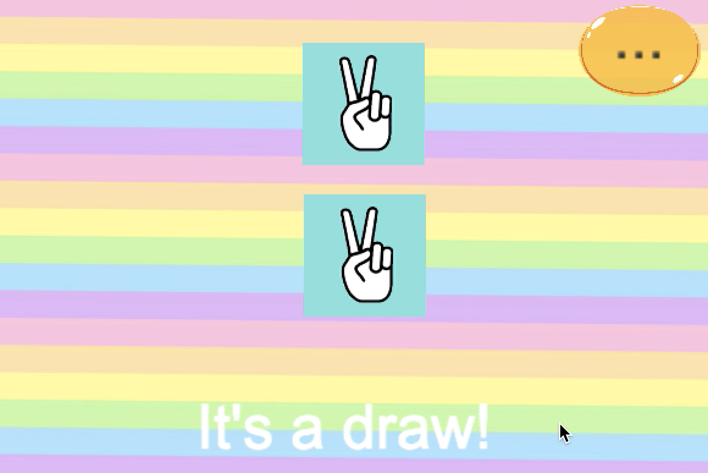
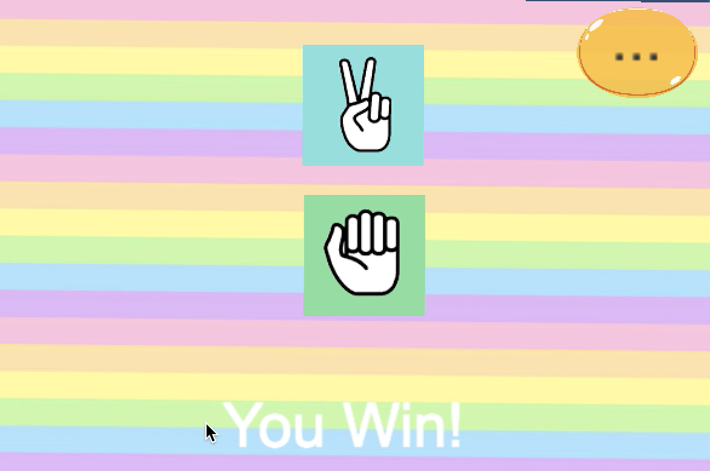
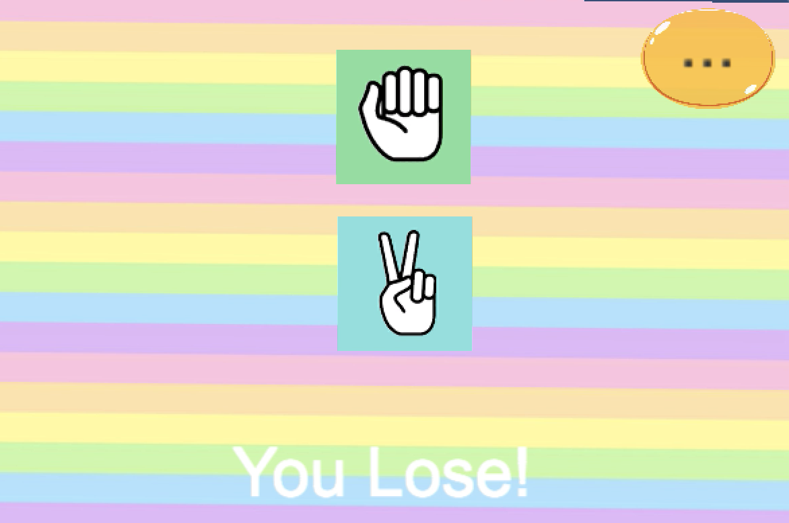
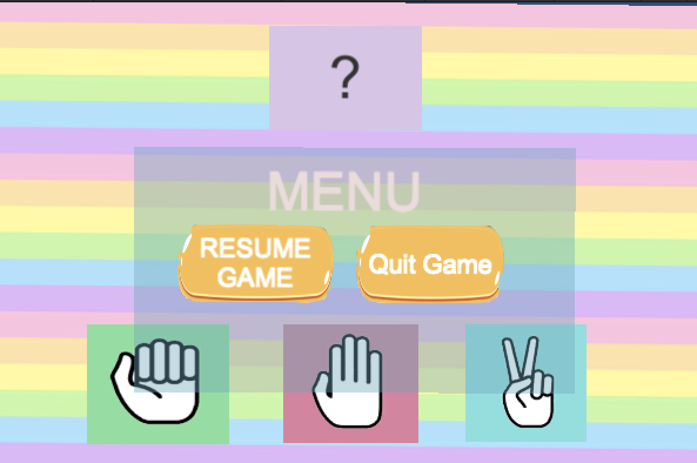

# Rock-Paper-ScissorsUnityGame
A 2D RockPaperScissors Game made in Unity and written in C#
 

 

  

 

 

 

 
<h1> Getting Started </h1>
 
Follow the below instructions to get started with Rock Paper Scissors source code:
 
1.Make sure you have all Requirements
 
2.Download Source Code
 
3.Open Project in Unity
 
<h1> Requirements </h1>
 
Make sure you have the below requirements before starting:
 
1.Unity Game Engine
 
2.Basic Knowledge about Unity and C#
 
